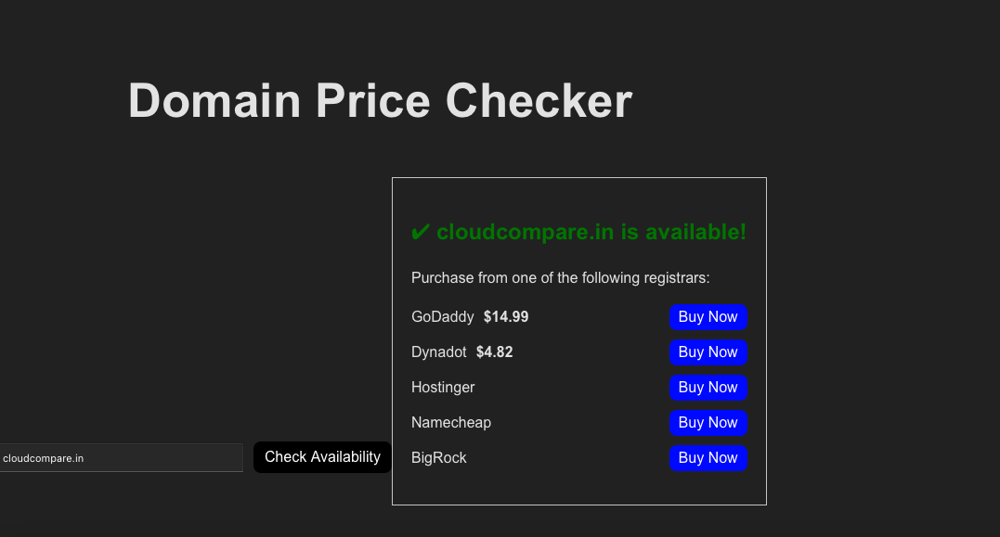

# iCanSearch.com - Domain Price Checker Demo 🚀🔎

This project is a proof-of-concept that checks domain availability and displays real-time prices from multiple registrars. It helps validate our idea by:

- ✅ Checking if a domain is available
- 📜 Listing registrar options where users can buy the domain
- 💲 Fetching real-time pricing data (currently integrated with GoDaddy and Dynadot)

## Features ✨

- **Real-time Domain Availability:** Quickly verify if a domain is free for registration.
- **Multiple Registrar Options:** See a list of potential registrars to purchase your domain.
- **Live Price Data:** Retrieves the latest pricing from GoDaddy and Dynadot via their APIs.
- **Boilerplate/Testing Project:** A minimal setup to experiment and validate domain price checking.

## Project Structure 📁

/project-root /frontend - React app for the user interface /backend - Express server handling API requests README.md .gitignore


## Getting Started 🛠

### Prerequisites

- Node.js (v14+ recommended)
- npm or yarn

### Installation

1. **Clone the repository:**

   ```bash
   git clone https://github.com/yourusername/domain-price-checker-demo.git
   cd domain-price-checker-demo

2. **Setup the Backend:**
    
    cd backend
    npm install
    node server.js

3. **Setup the Frontend:**

    cd frontend
    npm install
    npm start

### Environment Variables 🔑
For security, make sure to store your API keys in a .env file within the backend folder. Do not commit these keys to GitHub.
Create a .env file in the backend directory with the following:

GODADDY_API_KEY=your_godaddy_api_key
GODADDY_API_SECRET=your_godaddy_api_secret
DYNADOT_API_KEY=your_dynadot_api_key

Then, update your backend code to use these environment variables (e.g., using the dotenv package).

### Usage 💻

1. Start both the backend and frontend servers.
2. Open your browser and go to http://localhost:3000 (or the port where your frontend is running).
3. Enter a domain name (e.g., example.com) in the input field.
4. Click the "Check Availability" button to see if the domain is available and view the pricing details from different registrars.


# Preview

